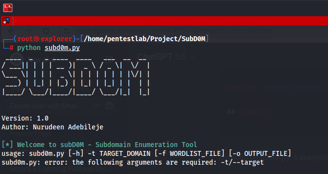
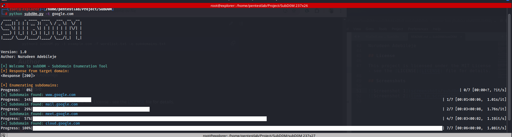
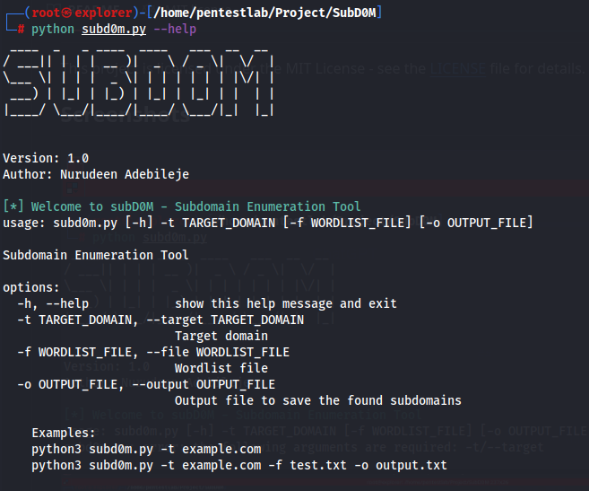

# Subdomain Enumeration Tool (subD0M)

subD0M is a Python-based command-line tool for enumerating subdomains of a target domain using a wordlist file. It utilizes the requests library to make HTTP requests to potential subdomains and identifies those that return valid responses.

## Features

- Enumerates subdomains of a target domain using a provided wordlist file.
- Supports both HTTP and HTTPS requests to subdomains.
- Saves the found subdomains to an output file for further analysis.

## Installation

1. Clone the repository:

```
git clone https://github.com/Nuru1d33n/subD0M.git
```

2. Install the required dependencies:

```
pip install -r requirements.txt
```

## Usage

Run the tool with the following command:

```
python3 subD0M.py -t <target_domain> -f <wordlist_file> -o <output_file>
```

Replace `<target_domain>` with the domain you want to enumerate subdomains for, `<wordlist_file>` with the path to the wordlist file containing potential subdomains, and `<output_file>` with the desired filename to save the found subdomains.


- `<target_domain>`: The domain you want to enumerate subdomains for.
- `<wordlist_file>`: The path to the wordlist file containing potential subdomains.
- `<output_file>`: The desired filename to save the found subdomains.

## Examples

```bash
python3 subd0m.py -t example.com
python3 subd0m.py -t example.com -f test.txt -o output.txt
```

## Author

Nurudeen Adebileje

## License

This project is licensed under the MIT License - see the [LICENSE](LICENSE) file for details.

## Screenshots





